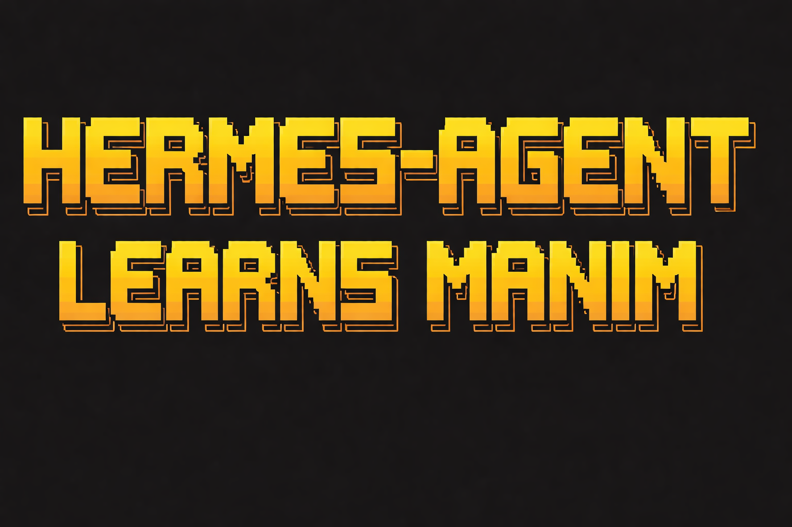

<p align="center">
  
</p>
<p align="center">
  
</p>

# HermesLearnsManim

<div align="center">

[](https://www.python.org/)
[](LICENSE)
[](https://ffmpeg.org/)
[](https://www.manim.community/)

</div>

> **Turn concepts into cinematic math animations using reverse-knowledge-tree reasoning.**

HermesLearnsManim is a Hermes-first workspace for generating Manim animations. Hermes owns the agent loop — this repo provides the MCP tools, workspace artifacts, validation helpers, and render hooks needed to turn a concept into a runnable animation.

---

## Why LaTeX-Rich Prompting Works

### The Problem with Vague Prompts

```
"Create an animation showing quantum field theory"
```
**Result**: Generic, incorrect, or broken code.

### The Solution: Verbose LaTeX Prompts

```
"Begin with Minkowski spacetime showing the metric:

$$ds^2 = -c^2 dt^2 + dx^2 + dy^2 + dz^2$$

Each component highlighted in different hues. Introduce the QED Lagrangian:

$$\mathcal{L}_{\text{QED}} = \bar{\psi}(i \gamma^\mu D_\mu - m)\psi - \tfrac{1}{4}F_{\mu\nu}F^{\mu\nu}$$

with Dirac spinor $\psi$ in orange, covariant derivative $D_\mu$ in green..."
```
**Result**: Perfect animations with correct LaTeX, camera movements, and timing.

Our agents generate these verbose prompts automatically by walking the knowledge tree.

---

## How It Works

The **reverse-knowledge-tree pipeline** decomposes any concept into a teachable sequence:

1. **Analyze** — Extract the core topic, audience, difficulty, and mathematical domain
2. **Discover** — Recursively ask *"What must I understand BEFORE this?"* to build a knowledge DAG
3. **Enrich** — Add LaTeX definitions, key equations, and theorems to each node
4. **Design** — Specify visual metaphors, camera movements, color palettes, and transitions
5. **Compose** — Weave a 2000+ token verbose prompt with exact LaTeX strings and timing
6. **Generate** — Produce working Manim Community Edition Python code

No training data. No examples needed. Pure LLM reasoning builds pedagogically sound animations that flow from foundations to advanced topics.

---

## What Lives Here

| Component | Description |
|:----------|:------------|
| **MCP Server** | Run initialization, artifact saving, validation, and rendering |
| **Hermes Skill Pack** | Reverse-knowledge-tree workflow definition |
| **Stable File Formats** | Analysis, knowledge trees, narrative plans, and generated Manim code |
| **Deterministic Validators** | LaTeX and Manim code validation |
| **Starter Prompts** | 8 curated cinematic prompts ready to paste into Hermes |

---

## Installation

### Prerequisites

| Requirement | Installation |
|:------------|:-------------|
| **Python 3.11+** | [python.org](https://www.python.org/) |
| **FFmpeg** | Required for video rendering (see below) |
| **LaTeX** | Required for MathTex rendering (see below) |

### FFmpeg Installation

```bash
# Windows (Chocolatey)
choco install ffmpeg

# Windows (Scoop)
scoop install ffmpeg

# Linux
sudo apt-get install ffmpeg

# macOS
brew install ffmpeg
```

### LaTeX Installation

```bash
# Windows — install MiKTeX
# Download from https://miktex.org/download

# Linux
sudo apt-get install texlive-full

# macOS
brew install --cask mactex
```

### Project Setup

```bash
git clone https://github.com/HarleyCoops/HermesLearnsManim.git
cd HermesLearnsManim
python -m venv .venv

# Activate virtual environment
# Windows:
.venv\Scripts\activate
# Linux/macOS:
source .venv/bin/activate

pip install -e ".[dev]"
```

### Verify Installation

```bash
# Check Manim is working
python -m manim --version

# Check FFmpeg
ffmpeg -version

# Run a test render
python -m manim -ql sandbox/geodesic.py GeodesicEquation
```

---

## Quickstart

### Start the MCP Server

```bash
python -m hermes_learns_manim.cli serve-mcp
```

### Configure Hermes

```bash
hermes setup
hermes model
```

### Run Your First Animation

Pick a prompt from the catalog and paste it into Hermes, or run directly:

```bash
# Initialize a run workspace
hermes-learns-manim init-run "Explain the Geodesic Equation"

# Render a scene
hermes-learns-manim render runs/<run-dir> GeodesicEquation --quality l
```

**Quality flags**: `l` low (480p15), `m` medium (720p30), `h` high (1080p60), `k` 4K

---

## Starter Prompts

The full prompt catalog lives in [`PROMPTS.md`](PROMPTS.md). Each entry includes the complete text ready to paste into Hermes:

| Prompt | Domain | Style |
|:-------|:-------|:------|
| [Cinematic Cosmology](PROMPTS.md#cinematic-cosmology) | Physics | 3D cinematic, cosmic vista |
| [Epic QED Journey](PROMPTS.md#epic-qed-journey) | Physics | 3D cinematic, particle physics |
| [Brownian Motion to Black-Scholes](PROMPTS.md#brownian-motion-to-black-scholes) | Finance | 3D cinematic, stochastic math |
| [Geodesic Equation](PROMPTS.md#geodesic-equation) | General Relativity | 3D, elegant off-white |
| [Whiskering Exchange Law](PROMPTS.md#whiskering-exchange-law) | Category Theory | 3D, clean modern |
| [Klein Bottle and Mobius Strip](PROMPTS.md#klein-bottle-and-mobius-strip) | Topology | 3D, semi-transparent wireframe |
| [Taylor Series Topology](PROMPTS.md#taylor-series-topology-of-convergence) | Analysis | 3D surfaces, convergence |
| [Pythagorean Theorem](PROMPTS.md#pythagorean-theorem-verbose-teaching-prompt) | Geometry | 2D, step-by-step teaching |

---

## Repository Structure

```
HermesLearnsManim/
├── src/hermes_learns_manim/
│   ├── cli.py              # CLI entry point
│   ├── config.py           # Pipeline settings
│   ├── mcp_server.py       # MCP server for Hermes
│   ├── models.py           # Data models
│   ├── pipeline.py         # Run manager / orchestration
│   ├── prompts.py          # Prompt templates
│   ├── renderer.py         # Manim render wrapper
│   ├── tools.py            # MCP tool definitions
│   └── io.py               # File I/O helpers
├── hermes/                 # Hermes skill pack
├── tests/                  # Test suite
├── sandbox/                # Scratch space for exploring animations
├── assets/                 # Hero images
├── docs/                   # Documentation
├── PROMPTS.md              # Curated starter prompt catalog
├── requirements.txt        # pip dependencies + system requirements
└── pyproject.toml          # Package configuration
```

---

## Common Pitfalls (And How We Solve Them)

| Problem | Traditional Approach | Our Solution |
|:--------|:--------------------|:-------------|
| **LaTeX Errors** | Hope for the best | Verbose prompts specify exact formulas |
| **Vague Cinematography** | "Show quantum field" | Specify colors, angles, timing |
| **Missing Prerequisites** | Jump to advanced topics | Recursive dependency discovery |
| **Inconsistent Notation** | Mixed symbols | Mathematical enricher maintains consistency |
| **Broken Manim Code** | Manual debugging | Deterministic validators catch issues early |

---

## Technical Requirements

- **Python**: 3.11+
- **Manim Community**: v0.19.0+
- **FFmpeg**: For video rendering
- **LaTeX**: MiKTeX (Windows), texlive (Linux), MacTeX (macOS)
- **RAM**: 8GB minimum, 16GB recommended

---

## Hermes Integration

This repo ships both pieces Hermes needs:

- `src/hermes_learns_manim/mcp_server.py` — deterministic operations
- `hermes/skills/hermes-learns-manim/SKILL.md` — workflow definition

The skill defines the workflow. The MCP server provides deterministic operations.

---

## Contributing

We welcome contributions:

1. **Add Prompts** — Create new starter prompts for unexplored domains
2. **Add Examples** — Generate and commit working animations
3. **Improve Validators** — Catch more LaTeX and Manim issues
4. **Fix Bugs** — Report and fix issues

---

## Related

This project evolved from [Math-To-Manim](https://github.com/HarleyCoops/Math-To-Manim), which offers three AI pipelines (Claude, Gemini, Kimi) with 55+ working example animations.

---

## License

MIT License — See [LICENSE](LICENSE)

---

<div align="center">

**Built with recursive reasoning, not training data.**

</div>
